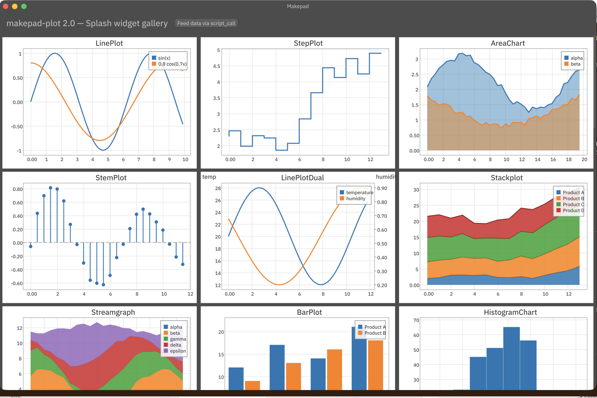

# makepad-plot

[English](README.md) | 简体中文

面向 **Makepad 2.0（Octoscript）**的 Matplotlib 风格绘图库：32 个图表控件，全部可以在 Octoscript DSL 中声明和脚本化。



## 控件

`LinePlot` `StepPlot` `AreaChart` `StemPlot` `LinePlotDual` `Stackplot` `Streamgraph` `BarPlot` `HistogramChart` `WaterfallChart` `CandlestickChart` `ScatterPlot` `BubbleChart` `HexbinChart` `PieChart` `DonutChart` `GaugeChart` `FunnelChart` `PolarPlot` `RadarChart` `BoxPlotChart` `ViolinPlot` `HeatmapChart`（别名 `Heatmap`）`ContourPlot` `QuiverPlot` `Surface3D` `Scatter3D` `Line3D` `Treemap` `SankeyDiagram` `SubplotGrid`/`SubplotRow`

每个图表开箱即渲染内置的演示数据，所以在 Octoscript 脚本里写一个空的 `LinePlot{}` 就能立刻看到内容。笛卡尔坐标系图表支持平移/缩放（`interactive: true`）；3D 图表支持拖动旋转和滚轮缩放。

## 用法

```rust
// app main.rs
pub use makepad_plot;
pub use makepad_plot::makepad_widgets;
use makepad_widgets::*;

app_main!(App);

script_mod! {
    use mod.prelude.widgets.*
    use mod.plot.*

    startup() do #(App::script_component(vm)){
        ui: Root{
            main_window := Window{
                body +: {
                    line := LinePlot{ title: "hello" interactive: true legend: LegendPosition.TopRight }
                }
            }
        }
    }
}

#[derive(Script, ScriptHook)]
pub struct App {
    #[live] ui: WidgetRef,
}

impl MatchEvent for App {}

impl AppMain for App {
    fn script_mod(vm: &mut ScriptVm) -> ScriptValue {
        makepad_widgets::script_mod(vm);
        makepad_plot::script_mod(vm);   // registers mod.plot
        self::script_mod(vm)
    }
    fn handle_event(&mut self, cx: &mut Cx, event: &Event) {
        self.match_event(cx, event);
        self.ui.handle_event(cx, event, &mut Scope::empty());
    }
}
```

在运行时从 Octoscript 传入数据（例如在 `on_click` 中）：

```octoscript
ui.line.set_title("LinePlot (scripted)")
ui.line.add_series("script", [0 1 2 3 4 5], [0 2 1 3 2.5 4])
ui.bar.set_data(["Q1" "Q2" "Q3" "Q4"], [12 19 8 15])
ui.gauge.set_value(42)
ui.heatmap.set_colormap("Plasma")
```

每个控件的 Octoscript 方法（`set_data`、`add_series`、`set_title`、`set_xlim`……）都通过 `Widget::script_call` 实现，详见 `src/charts/` 下的各图表模块。

## 演示

```
cargo run    # opens the full widget gallery (examples/plot_demo.rs)
```

## 设计与移植说明

架构说明，以及移植过程中发现的 Makepad 2.0 引擎问题（矢量图形上方文字的绘制顺序/深度规则、换行流式布局的限制、Octoscript 数组解析等），见 [OCTOSCRIPT_PORT.md](OCTOSCRIPT_PORT.md)。
